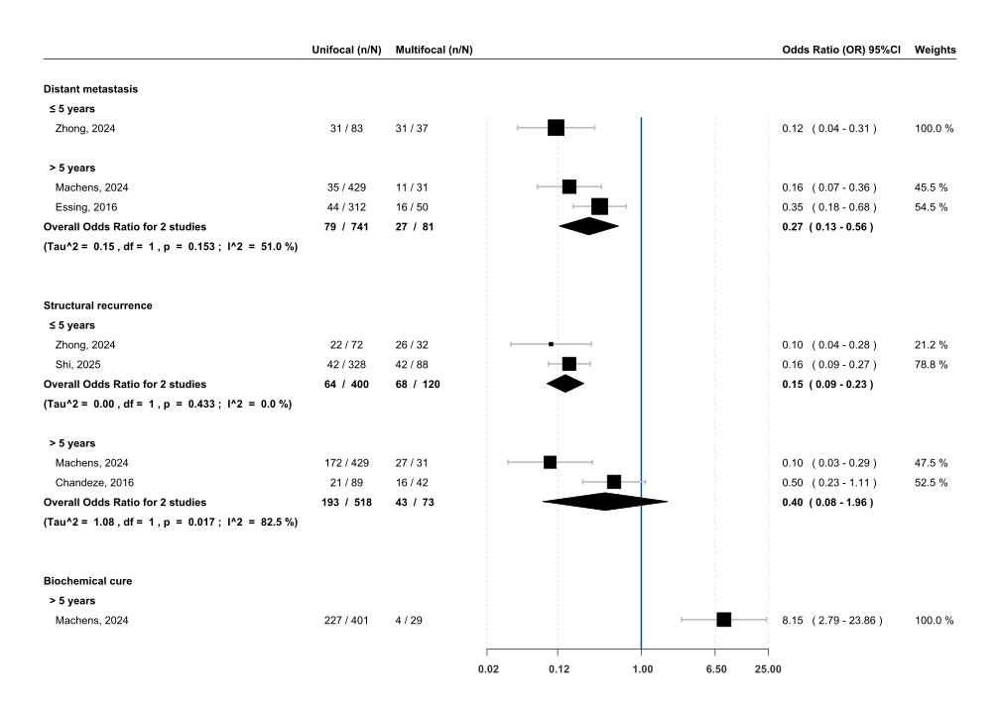
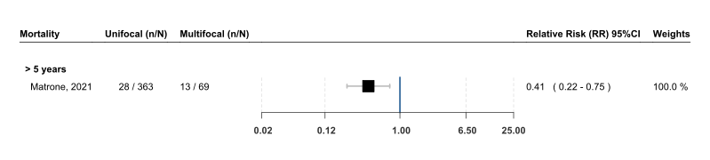

ASSESSMENT OF PREVALENCE AND FOCALITY OF CANCER MEDULAR THYROID
================
Luis A. Figueroa, Eddy Lincango, et. al.
2025-10-13

<i> Analysis and visualization developed by Luis A. Figueroa, Eddy
Lincango, et. al.</i>

The purpose of this site is to make our meta-analysis as transparent as
possible. All information or documents used, from the protocol to the
final publication, will be available here. If further information is
needed, please do not hesitate to contact us.

For this analysis we use R language [version
4.4.2](https://cran.r-project.org/bin/windows/base/old/4.4.2/) in R
studio [server](https://posit.co/download/rstudio-server/) to compute
the following results.

**Prevalence analyisis by region** We conducted prevalence analyses
using the `stats` package in R. Prevalence rates were calculated for all
studies included in our systematic review. Regional distributions across
world regions (Americas, Asia, Europe, and others) were assessed using
Chi-squared tests for given probabilities (chisq.test) without
correction.

We formulated null and alternative hypotheses regarding the expected
distribution of prevalence rates. We calculate Chi-squeared test in its
p-value using `chisq.test`. The Chi-squared test results led to
rejection of the null hypothesis in favor of the alternative hypothesis,
indicating that observed prevalence distributions differed significantly
from expected patterns for both bifocality (9.42% \[IC95%: -51.97 -
70.82; Chi-square: 55.53; p-value \< 0.01\]) and multifocal medullary
thyroid cancer (17.96% \[IC95%:-66.79 - 102.71; Chi-square: 26.02;
p-value \< 0.01\]).

<table class="gt_table" data-quarto-disable-processing="false" data-quarto-bootstrap="false">
  <thead>
    <tr class="gt_col_headings">
      <th class="gt_col_heading gt_columns_bottom_border gt_left" rowspan="1" colspan="1" scope="col" id="Location">Location</th>
      <th class="gt_col_heading gt_columns_bottom_border gt_left" rowspan="1" colspan="1" scope="col" id="Author">Author</th>
      <th class="gt_col_heading gt_columns_bottom_border gt_left" rowspan="1" colspan="1" scope="col" id="Bilaterality-n/N-(%)*">Bilaterality n/N (%)*</th>
      <th class="gt_col_heading gt_columns_bottom_border gt_left" rowspan="1" colspan="1" scope="col" id="Multifocality-general-n/N-(%)*">Multifocality general n/N (%)*</th>
    </tr>
  </thead>
  <tbody class="gt_table_body">
    <tr><td headers="Location" class="gt_row gt_left" style="font-weight: bold;">AMERICA</td>
<td headers="Author" class="gt_row gt_left" style="font-weight: bold;"> </td>
<td headers="Bilaterality n/N (%)*" class="gt_row gt_left" style="font-weight: bold;"> </td>
<td headers="Multifocality general n/N (%)*" class="gt_row gt_left" style="font-weight: bold;"> </td></tr>
    <tr><td headers="Location" class="gt_row gt_left">USA</td>
<td headers="Author" class="gt_row gt_left">Mao, 2024</td>
<td headers="Bilaterality n/N (%)*" class="gt_row gt_left">13/79 (16.46)</td>
<td headers="Multifocality general n/N (%)*" class="gt_row gt_left">13/79 (16.46)</td></tr>
    <tr><td headers="Location" class="gt_row gt_left">USA</td>
<td headers="Author" class="gt_row gt_left">Kotwal, 2021</td>
<td headers="Bilaterality n/N (%)*" class="gt_row gt_left">10/102 (9.8)</td>
<td headers="Multifocality general n/N (%)*" class="gt_row gt_left">16/102 (15.69)</td></tr>
    <tr><td headers="Location" class="gt_row gt_left">BRAZIL</td>
<td headers="Author" class="gt_row gt_left">da Silveira Duval, 2023</td>
<td headers="Bilaterality n/N (%)*" class="gt_row gt_left"> </td>
<td headers="Multifocality general n/N (%)*" class="gt_row gt_left">24/167 (14.37)</td></tr>
    <tr><td headers="Location" class="gt_row gt_left">USA</td>
<td headers="Author" class="gt_row gt_left">Grubbs, 2016</td>
<td headers="Bilaterality n/N (%)*" class="gt_row gt_left">2/76 (2.63)</td>
<td headers="Multifocality general n/N (%)*" class="gt_row gt_left">11/76 (14.47)</td></tr>
    <tr><td headers="Location" class="gt_row gt_left">USA</td>
<td headers="Author" class="gt_row gt_left">Kebebew, 2000</td>
<td headers="Bilaterality n/N (%)*" class="gt_row gt_left">39/58 (67.24)</td>
<td headers="Multifocality general n/N (%)*" class="gt_row gt_left">39/58 (67.24)</td></tr>
    <tr><td headers="Location" class="gt_row gt_left">USA</td>
<td headers="Author" class="gt_row gt_left">Samulski, 2014</td>
<td headers="Bilaterality n/N (%)*" class="gt_row gt_left">7/39 (17.95)</td>
<td headers="Multifocality general n/N (%)*" class="gt_row gt_left">7/39 (17.95)</td></tr>
    <tr><td headers="Location" class="gt_row gt_left">USA</td>
<td headers="Author" class="gt_row gt_left">Santrac, 2018</td>
<td headers="Bilaterality n/N (%)*" class="gt_row gt_left"> </td>
<td headers="Multifocality general n/N (%)*" class="gt_row gt_left">1/18 (5.56)</td></tr>
    <tr><td headers="Location" class="gt_row gt_left" style="font-weight: bold;">Statisticals by region: </td>
<td headers="Author" class="gt_row gt_left" style="font-weight: bold;"> </td>
<td headers="Bilaterality n/N (%)*" class="gt_row gt_left" style="font-weight: bold;">71/354 (20)</td>
<td headers="Multifocality general n/N (%)*" class="gt_row gt_left" style="font-weight: bold;">111/539 (21)</td></tr>
    <tr><td headers="Location" class="gt_row gt_left"> </td>
<td headers="Author" class="gt_row gt_left"> </td>
<td headers="Bilaterality n/N (%)*" class="gt_row gt_left"> </td>
<td headers="Multifocality general n/N (%)*" class="gt_row gt_left"> </td></tr>
    <tr><td headers="Location" class="gt_row gt_left" style="font-weight: bold;">ASIA</td>
<td headers="Author" class="gt_row gt_left" style="font-weight: bold;"> </td>
<td headers="Bilaterality n/N (%)*" class="gt_row gt_left" style="font-weight: bold;"> </td>
<td headers="Multifocality general n/N (%)*" class="gt_row gt_left" style="font-weight: bold;"> </td></tr>
    <tr><td headers="Location" class="gt_row gt_left">CHINA</td>
<td headers="Author" class="gt_row gt_left">Chow, 2005</td>
<td headers="Bilaterality n/N (%)*" class="gt_row gt_left">2/19 (10.53)</td>
<td headers="Multifocality general n/N (%)*" class="gt_row gt_left">4/19 (21.05)</td></tr>
    <tr><td headers="Location" class="gt_row gt_left">CHINA</td>
<td headers="Author" class="gt_row gt_left">Shi, 2025</td>
<td headers="Bilaterality n/N (%)*" class="gt_row gt_left">34/416 (8.17)</td>
<td headers="Multifocality general n/N (%)*" class="gt_row gt_left">88/416 (21.15)</td></tr>
    <tr><td headers="Location" class="gt_row gt_left">JAPAN</td>
<td headers="Author" class="gt_row gt_left">Miyauchi, 2002</td>
<td headers="Bilaterality n/N (%)*" class="gt_row gt_left">0/40 (0)</td>
<td headers="Multifocality general n/N (%)*" class="gt_row gt_left">0/40 (0)</td></tr>
    <tr><td headers="Location" class="gt_row gt_left">ISRAEL</td>
<td headers="Author" class="gt_row gt_left">Twito, 2019</td>
<td headers="Bilaterality n/N (%)*" class="gt_row gt_left">20/126 (15.87)</td>
<td headers="Multifocality general n/N (%)*" class="gt_row gt_left">35/121 (28.93)</td></tr>
    <tr><td headers="Location" class="gt_row gt_left">JAPAN</td>
<td headers="Author" class="gt_row gt_left">Kihara, 2016</td>
<td headers="Bilaterality n/N (%)*" class="gt_row gt_left">1/52 (1.92)</td>
<td headers="Multifocality general n/N (%)*" class="gt_row gt_left">1/52 (1.92)</td></tr>
    <tr><td headers="Location" class="gt_row gt_left">KOREA</td>
<td headers="Author" class="gt_row gt_left">Lee, 2016</td>
<td headers="Bilaterality n/N (%)*" class="gt_row gt_left">9/63 (14.29)</td>
<td headers="Multifocality general n/N (%)*" class="gt_row gt_left">10/65 (15.38)</td></tr>
    <tr><td headers="Location" class="gt_row gt_left">CHINA</td>
<td headers="Author" class="gt_row gt_left">Ma, 2011</td>
<td headers="Bilaterality n/N (%)*" class="gt_row gt_left">0/12 (0)</td>
<td headers="Multifocality general n/N (%)*" class="gt_row gt_left">0/12 (0)</td></tr>
    <tr><td headers="Location" class="gt_row gt_left">ISRAEL</td>
<td headers="Author" class="gt_row gt_left">Rozenblat, 2020</td>
<td headers="Bilaterality n/N (%)*" class="gt_row gt_left">16/80 (20)</td>
<td headers="Multifocality general n/N (%)*" class="gt_row gt_left">22/80 (27.5)</td></tr>
    <tr><td headers="Location" class="gt_row gt_left">INDIA</td>
<td headers="Author" class="gt_row gt_left">Yadav, 2018</td>
<td headers="Bilaterality n/N (%)*" class="gt_row gt_left">0/71 (0)</td>
<td headers="Multifocality general n/N (%)*" class="gt_row gt_left">20/71 (28.17)</td></tr>
    <tr><td headers="Location" class="gt_row gt_left">CHINA</td>
<td headers="Author" class="gt_row gt_left">Zhang, 2022</td>
<td headers="Bilaterality n/N (%)*" class="gt_row gt_left"> </td>
<td headers="Multifocality general n/N (%)*" class="gt_row gt_left">10/49 (20.41)</td></tr>
    <tr><td headers="Location" class="gt_row gt_left">CHINA</td>
<td headers="Author" class="gt_row gt_left">Zhong, 2024</td>
<td headers="Bilaterality n/N (%)*" class="gt_row gt_left"> </td>
<td headers="Multifocality general n/N (%)*" class="gt_row gt_left">37/120 (30.83)</td></tr>
    <tr><td headers="Location" class="gt_row gt_left" style="font-weight: bold;">Statisticals by region: </td>
<td headers="Author" class="gt_row gt_left" style="font-weight: bold;"> </td>
<td headers="Bilaterality n/N (%)*" class="gt_row gt_left" style="font-weight: bold;">82/879 (9)</td>
<td headers="Multifocality general n/N (%)*" class="gt_row gt_left" style="font-weight: bold;">227/1045 (22)</td></tr>
    <tr><td headers="Location" class="gt_row gt_left"> </td>
<td headers="Author" class="gt_row gt_left"> </td>
<td headers="Bilaterality n/N (%)*" class="gt_row gt_left"> </td>
<td headers="Multifocality general n/N (%)*" class="gt_row gt_left"> </td></tr>
    <tr><td headers="Location" class="gt_row gt_left" style="font-weight: bold;">EUROPE</td>
<td headers="Author" class="gt_row gt_left" style="font-weight: bold;"> </td>
<td headers="Bilaterality n/N (%)*" class="gt_row gt_left" style="font-weight: bold;"> </td>
<td headers="Multifocality general n/N (%)*" class="gt_row gt_left" style="font-weight: bold;"> </td></tr>
    <tr><td headers="Location" class="gt_row gt_left">GERMANY</td>
<td headers="Author" class="gt_row gt_left">Mechens, 2024</td>
<td headers="Bilaterality n/N (%)*" class="gt_row gt_left">15/462 (3.25)</td>
<td headers="Multifocality general n/N (%)*" class="gt_row gt_left">31/462 (6.71)</td></tr>
    <tr><td headers="Location" class="gt_row gt_left">FRANCE</td>
<td headers="Author" class="gt_row gt_left">Chandeze, 2016</td>
<td headers="Bilaterality n/N (%)*" class="gt_row gt_left">19/131 (14.5)</td>
<td headers="Multifocality general n/N (%)*" class="gt_row gt_left">42/131 (32.06)</td></tr>
    <tr><td headers="Location" class="gt_row gt_left">AUSTRIA</td>
<td headers="Author" class="gt_row gt_left">Kaserer, 2001</td>
<td headers="Bilaterality n/N (%)*" class="gt_row gt_left">3/34 (8.82)</td>
<td headers="Multifocality general n/N (%)*" class="gt_row gt_left">3/34 (8.82)</td></tr>
    <tr><td headers="Location" class="gt_row gt_left">ITALY</td>
<td headers="Author" class="gt_row gt_left">Matrone, 2021</td>
<td headers="Bilaterality n/N (%)*" class="gt_row gt_left"> </td>
<td headers="Multifocality general n/N (%)*" class="gt_row gt_left">69/432 (15.97)</td></tr>
    <tr><td headers="Location" class="gt_row gt_left">PORTUGAL</td>
<td headers="Author" class="gt_row gt_left">Moura, 2009</td>
<td headers="Bilaterality n/N (%)*" class="gt_row gt_left"> </td>
<td headers="Multifocality general n/N (%)*" class="gt_row gt_left">12/51 (23.53)</td></tr>
    <tr><td headers="Location" class="gt_row gt_left">SERBIA</td>
<td headers="Author" class="gt_row gt_left">Santrac, 2020</td>
<td headers="Bilaterality n/N (%)*" class="gt_row gt_left"> </td>
<td headers="Multifocality general n/N (%)*" class="gt_row gt_left">2/18 (11.11)</td></tr>
    <tr><td headers="Location" class="gt_row gt_left">ITALY</td>
<td headers="Author" class="gt_row gt_left">Prinzi, 2024</td>
<td headers="Bilaterality n/N (%)*" class="gt_row gt_left">2/62 (3.23)</td>
<td headers="Multifocality general n/N (%)*" class="gt_row gt_left">4/62 (6.45)</td></tr>
    <tr><td headers="Location" class="gt_row gt_left">ATHENS</td>
<td headers="Author" class="gt_row gt_left">Saltiki, 2019</td>
<td headers="Bilaterality n/N (%)*" class="gt_row gt_left"> </td>
<td headers="Multifocality general n/N (%)*" class="gt_row gt_left">29/163 (17.79)</td></tr>
    <tr><td headers="Location" class="gt_row gt_left">FRANCE</td>
<td headers="Author" class="gt_row gt_left">Hamy, 2005</td>
<td headers="Bilaterality n/N (%)*" class="gt_row gt_left">2/43 (4.65)</td>
<td headers="Multifocality general n/N (%)*" class="gt_row gt_left">11/43 (25.58)</td></tr>
    <tr><td headers="Location" class="gt_row gt_left">SWEDEN</td>
<td headers="Author" class="gt_row gt_left">Bumming, 2008</td>
<td headers="Bilaterality n/N (%)*" class="gt_row gt_left">3/20 (15)</td>
<td headers="Multifocality general n/N (%)*" class="gt_row gt_left">5/20 (25)</td></tr>
    <tr><td headers="Location" class="gt_row gt_left">GERMANY</td>
<td headers="Author" class="gt_row gt_left">Cupisti, 2017</td>
<td headers="Bilaterality n/N (%)*" class="gt_row gt_left"> </td>
<td headers="Multifocality general n/N (%)*" class="gt_row gt_left">16/179 (8.94)</td></tr>
    <tr><td headers="Location" class="gt_row gt_left">FRANCE</td>
<td headers="Author" class="gt_row gt_left">Mirallie, 2004</td>
<td headers="Bilaterality n/N (%)*" class="gt_row gt_left"> </td>
<td headers="Multifocality general n/N (%)*" class="gt_row gt_left">5/52 (9.62)</td></tr>
    <tr><td headers="Location" class="gt_row gt_left">BELGIUM</td>
<td headers="Author" class="gt_row gt_left">Pilaete, 2012</td>
<td headers="Bilaterality n/N (%)*" class="gt_row gt_left"> </td>
<td headers="Multifocality general n/N (%)*" class="gt_row gt_left">7/32 (21.88)</td></tr>
    <tr><td headers="Location" class="gt_row gt_left">ITALY</td>
<td headers="Author" class="gt_row gt_left">Rapa, 2011</td>
<td headers="Bilaterality n/N (%)*" class="gt_row gt_left"> </td>
<td headers="Multifocality general n/N (%)*" class="gt_row gt_left">5/37 (13.51)</td></tr>
    <tr><td headers="Location" class="gt_row gt_left">FRANCE</td>
<td headers="Author" class="gt_row gt_left">Scollo, 2003</td>
<td headers="Bilaterality n/N (%)*" class="gt_row gt_left">7/54 (12.96)</td>
<td headers="Multifocality general n/N (%)*" class="gt_row gt_left">7/54 (12.96)</td></tr>
    <tr><td headers="Location" class="gt_row gt_left">AUSTRIA</td>
<td headers="Author" class="gt_row gt_left">Scheuba, 2009</td>
<td headers="Bilaterality n/N (%)*" class="gt_row gt_left"> </td>
<td headers="Multifocality general n/N (%)*" class="gt_row gt_left">23/116 (19.83)</td></tr>
    <tr><td headers="Location" class="gt_row gt_left">GERMANY</td>
<td headers="Author" class="gt_row gt_left">Weber, 2001</td>
<td headers="Bilaterality n/N (%)*" class="gt_row gt_left"> </td>
<td headers="Multifocality general n/N (%)*" class="gt_row gt_left">3/16 (18.75)</td></tr>
    <tr><td headers="Location" class="gt_row gt_left" style="font-weight: bold;">Statisticals by region: </td>
<td headers="Author" class="gt_row gt_left" style="font-weight: bold;"> </td>
<td headers="Bilaterality n/N (%)*" class="gt_row gt_left" style="font-weight: bold;">51/806 (6)</td>
<td headers="Multifocality general n/N (%)*" class="gt_row gt_left" style="font-weight: bold;">274/1902 (14)</td></tr>
    <tr><td headers="Location" class="gt_row gt_left"> </td>
<td headers="Author" class="gt_row gt_left"> </td>
<td headers="Bilaterality n/N (%)*" class="gt_row gt_left"> </td>
<td headers="Multifocality general n/N (%)*" class="gt_row gt_left"> </td></tr>
    <tr><td headers="Location" class="gt_row gt_left" style="font-weight: bold;">ANOTHER</td>
<td headers="Author" class="gt_row gt_left" style="font-weight: bold;"> </td>
<td headers="Bilaterality n/N (%)*" class="gt_row gt_left" style="font-weight: bold;"> </td>
<td headers="Multifocality general n/N (%)*" class="gt_row gt_left" style="font-weight: bold;"> </td></tr>
    <tr><td headers="Location" class="gt_row gt_left">MULTICENTER</td>
<td headers="Author" class="gt_row gt_left">Essig, 2016</td>
<td headers="Bilaterality n/N (%)*" class="gt_row gt_left">17/306 (5.56)</td>
<td headers="Multifocality general n/N (%)*" class="gt_row gt_left">50/312 (16.03)</td></tr>
    <tr><td headers="Location" class="gt_row gt_left">AUSTRALIA</td>
<td headers="Author" class="gt_row gt_left">Jayakody, 2018</td>
<td headers="Bilaterality n/N (%)*" class="gt_row gt_left"> </td>
<td headers="Multifocality general n/N (%)*" class="gt_row gt_left">48/156 (30.77)</td></tr>
    <tr><td headers="Location" class="gt_row gt_left" style="font-weight: bold;">Statisticals by region: </td>
<td headers="Author" class="gt_row gt_left" style="font-weight: bold;"> </td>
<td headers="Bilaterality n/N (%)*" class="gt_row gt_left" style="font-weight: bold;">17/306 (6)</td>
<td headers="Multifocality general n/N (%)*" class="gt_row gt_left" style="font-weight: bold;">98/468 (21)</td></tr>
    <tr><td headers="Location" class="gt_row gt_left"> </td>
<td headers="Author" class="gt_row gt_left"> </td>
<td headers="Bilaterality n/N (%)*" class="gt_row gt_left"> </td>
<td headers="Multifocality general n/N (%)*" class="gt_row gt_left"> </td></tr>
    <tr><td headers="Location" class="gt_row gt_left" style="font-weight: bold;">GLOBAL DATA: </td>
<td headers="Author" class="gt_row gt_left" style="font-weight: bold;">NA</td>
<td headers="Bilaterality n/N (%)*" class="gt_row gt_left" style="font-weight: bold;">221/2345 (9.42) [IC95%: -51.97 to 70.82; Chi-square: 55.53; p-value &lt; 0.01]</td>
<td headers="Multifocality general n/N (%)*" class="gt_row gt_left" style="font-weight: bold;">710/3954 (17.96) [IC95%:-66.79 to 102.71; Chi-square: 26.02; p-value &lt; 0.01]</td></tr>
    <tr><td headers="Location" class="gt_row gt_left"> </td>
<td headers="Author" class="gt_row gt_left"> </td>
<td headers="Bilaterality n/N (%)*" class="gt_row gt_left"> </td>
<td headers="Multifocality general n/N (%)*" class="gt_row gt_left"> </td></tr>
  </tbody>
  &#10;</table>

(\*) At global data we report n/N (%) \[IC95, Chi-square, p-value\]

**Meta-analysis** We performed a meta-analyses using the `metafor` and
`forestplot` packages. We computed effect sizes comparing unifocal
versus multifocal medullary thyroid cancer across several clinical
outcomes: distant metastasis, structural recurrence, biochemical cure,
and mortality. Analyses were divided considering our data that were
marked in two parts of time (less and upper or equal than 5 years).

Random effects models were implemented using the `metafor` package, with
heterogeneity addressed through Restricted Maximum Likelihood (REML)
estimation. Effect sizes were calculated as relative risk (RR) for
mortality and odds ratios (OR) for structural recurrence, biochemical
cure, and distant metastasis using the escalc function. All outcomes
incorporated Knapp-Hartung adjustments for 95% confidence intervals.
Heterogeneity was quantified using Tau² and I² statistics.

 

<b>Figure A. -</b> Distant metastasis, Structural recurrence,
Biochemical cure: Analysis with Odds Ratio (OR) 95%CI

 

<!-- -->

 

<b>Figure B. -</b> Mortality: Analysis with Relative Risk (RR) 95%CI

  <!-- -->

